# 最长路问题

## 题目描述

给你一个 $n\times m$ 的矩阵，有 $q$ 个格子是障碍，第 $i$ 个障碍在 $(x_i, y_i)$，其他的格子是空格，求从左上角到右下角最长路的长度。

## 数据范围

$2 \le n,m \le 10, 0 \le q \le 100, 1\le x_i\le n, 1\le y_i\le m$。

在解这道题前先介绍一下插头 DP。

## 插头 DP

插头 DP 是基于连通性状态压缩的动态规划，所以先学状压 DP 再学插头 DP。

## 插头

插头表示一个格子与对应方向的格子是否连通。

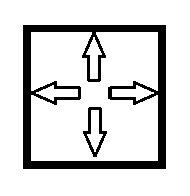

现有左右两个格子，如果两个格子连通，那么左边的格子有一个向右的插头，右边的格子有一个向左的插头，所以插头是成对存在的。

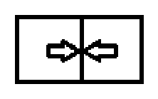

## 轮廓线

轮廓线表示已决策状态和未决策状态的分界线。

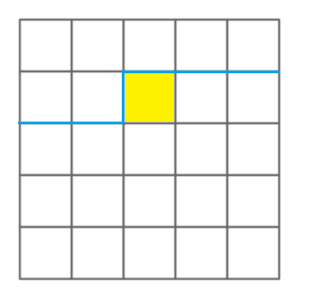

轮廓线由 $m+1$ 条边构成，每条边对应唯一一个格子（要么在上，要么在左），设第 $i$ 条边的状态为 $s_i$，如果一条边对应的格子有一个向这条边方向的插头，那么 $s_i \ge 1$；否则 $s_i = 0$。

任取两条不同的边 $i, j$，如果 $s_i = s_j$，则表示第 $i$ 条边上的插头和第 $j$ 条边上的插头是连通的。

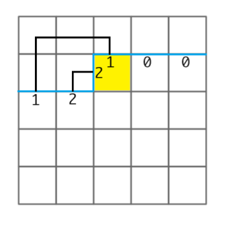

## 状态压缩

轮廓线有 $m+1$ 条边，至多有 $\left\lfloor\frac{m+1}{2}\right\rfloor$ 对连通的插头，每对插头用不同的 $\ge 1$ 的整数表示，$0$ 表示没有插头，所以每条边有 $\left\lfloor\frac{m+1}{2}\right\rfloor+1$ 个状态，需要用 $3$ 个二进制位表示，所以一条轮廓线需要用 $3\times (m+1)$ 个二进制位表示，把 $m=10$ 代入算出 $33$，可以用一个 `long long` 存储。

## 状态设计

设 $dp_{i,j,s}$ 表示决策到第 $i$ 行第 $j$ 列，轮廓线状态为 $s$ 的最大长度，这个长度表示已经放了路径的格子总数，路径不一定连通，但算完答案后路径是连通的，且没有多余的放了路径但没有走到的格子。

## 状态转移

决策顺序由上往下，从左往右，假设要从格子 $(i, j-1)$ 转移到 $(i, j)$，枚举 $(i, j-1)$ 的所有轮廓线 $s$，$le$ 表示 $(i, j)$ 左边的格子向右的插头的状态，即第 $j$ 条边的状态，$up$ 表示 $(i, j)$ 上面的格子向下的插头的状态，即第 $j+1$ 条边的状态，$ban_{i,j}$ 表示第 $i$ 行第 $j$ 列是否有障碍，有障碍为 $1$。

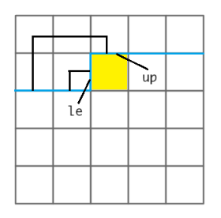

如果 $ban_{i,j}=1$，那么当且仅当 $le=0$ 且 $up=0$ 时，$dp_{i,j,s} = dp_{i,j-1,s}$。

如果 $ban_{i,j}=0$，那么：

如果 $le=0$ 且 $up=0$，那么有两种选择：

$1.$ 不放路径，$dp_{i,j,s} = dp_{i,j-1,s}$。

$2.$ 放路径，在 $(i, j)$ 放一个向下的插头和一个向右的插头，因为两个插头是连通的，所以它们编号一样，令 $s_j=8,s_{j+1}=8$ （这里的 $8$ 表示一个新的编号，需要重新编码变成最小的可用编号） 得到新的轮廓线状态 $t$，$dp_{i,j,t} = dp_{i,j-1,s}+1$。

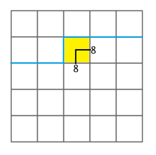

如果 $le,up$ 中恰好一个为 $0$ 另一个不为 $0$，那么当前格子必须放路径，方向有两个选择：

$1.$ 在 $(i, j)$ 放一个向右的插头，它的编号和原来一样，令 $s_j=0, s_{j+1}=le+up$ 得到新的轮廓线状态 $t$，$dp_{i,j,t} = dp_{i,j-1,s}+1$。

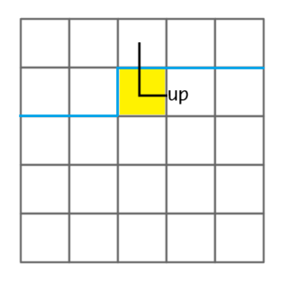

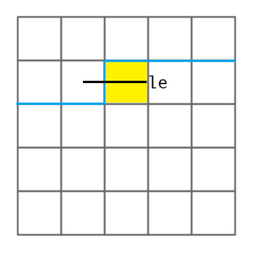

$2.$ 在 $(i, j)$ 放一个向下的插头，它的编号和原来一样，令 $s_j=le+up, s_{j+1}=0$ 得到新的轮廓线状态 $t$，$dp_{i,j,t} = dp_{i,j-1,s}+1$。

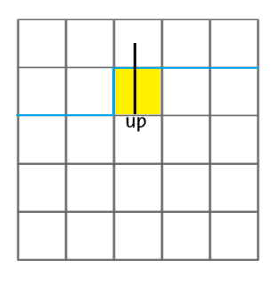

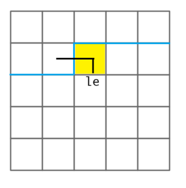

如果 $le,up$ 都不为 $0$ 且 $le=up$ 那么这个状态无效。

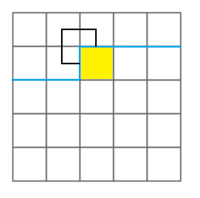

前面说过，轮廓线上的插头是成对存在的，但这题有点特殊，从起点到轮廓线上的边所对应的插头只有一个，因为另一个插头在起点，要给这个插头单独编号为 1。

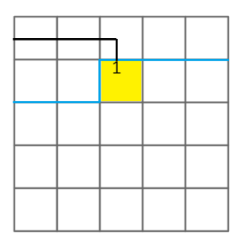

如果 $le,up$ 都不为 $0$ 且 $le\neq up$ ，那么必须在当前格子放一个向上的插头和一个向左的插头。

如果 $le=1$，那么找到轮廓线上满足 $s_k=up,k\neq j+1$ 的 $k$，即与第 $j+1$ 个插头连通的另一个插头，令 $s_j=0,s_{j+1}=0,s_k=1$ 得到新的轮廓线状态 $t$，$dp_{i,j,t} = dp_{i,j-1,s}+1$。

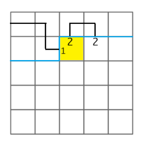

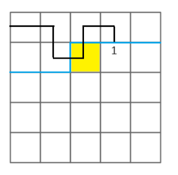

如果 $up=1$，那么找到轮廓线上满足 $s_k=le,k\neq j$ 的 $k$，即与第 $j$ 个插头连通的另一个插头，令 $s_j=0,s_{j+1}=0,s_k=1$ 得到新的轮廓线状态 $t$，$dp_{i,j,t} = dp_{i,j-1,s}+1$。

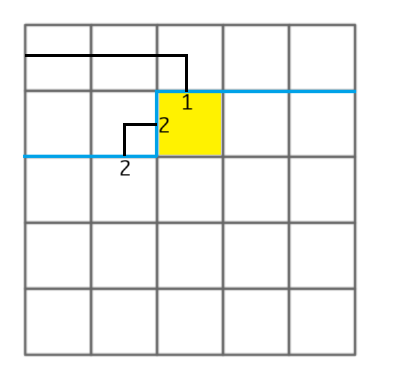

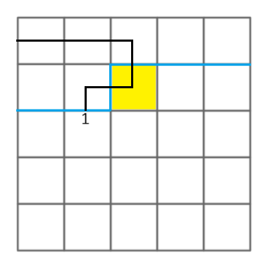

如果 $le,up$ 都不为 $1$，那么找到轮廓线上满足 $s_k=up,k\neq j+1$ 的 $k$，即与第 $j+1$ 个插头连通的另一个插头，令 $s_j=0,s_{j+1}=0,s_k=le$ 得到新的轮廓线状态 $t$，$dp_{i,j,t} = dp_{i,j-1,s}+1$。

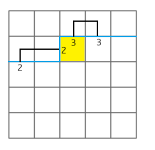

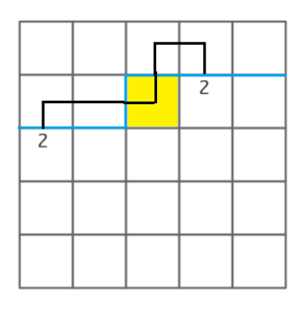

## 轮廓线滚动

在决策完第 $m-1$ 列的格子后，轮廓线的状态如下：

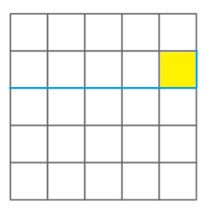

最后一条边有插头的状态无效，若最后一条边没有插头则把最后一条边删掉，然后在开头加上一条没有插头的边。

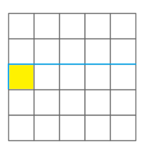

## 初始状态和结束状态

初始状态轮廓线第 $1$ 条边应该有一个编号为 $1$ 的插头。

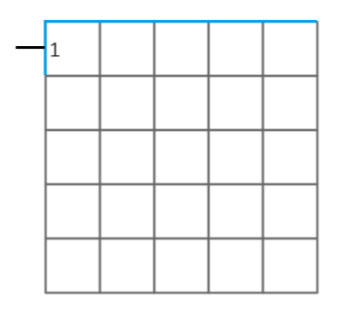

在最后一次轮廓线滚动后，结束状态轮廓线最后一条边应该有一个编号为 $1$ 的插头。

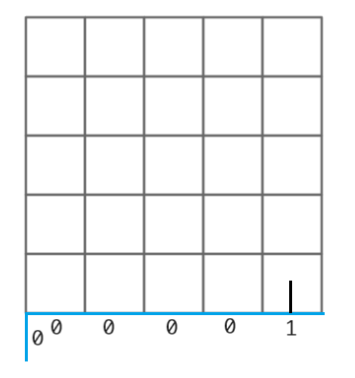

然后就做完了。

## 代码

```cpp
#include <bits/stdc++.h>
using namespace std;
#define int long long
#define uint unsigned int
#define pii pair<int, int>
template <typename T> using vector2 = vector<vector<T>>;
template <typename T> using MaxHeap = priority_queue<T>;
template <typename T> using MinHeap = priority_queue<T, vector<T>, greater<T>>;
#define all(x) (x).begin(), (x).end()
// #define endl '\n'
// #define endl " line in : " << __LINE__ << endl
const int N = 15, M = 11, INF = 1e16, P = 998244353;
int n, m, q, ban[10][10];
unordered_map<int, int> f0, f1;
array<int, M> decode(int s) {
  array<int, M> x = {};
  for (int i = 0; i <= m; i++)
    x[i] = s & 7, s >>= 3;
  return x;
}
int encode(array<int, M> x) {
  int s = 0;
  for (int i = m; i >= 0; i--)
    s = s << 3 | x[i];
  return s;
}
array<int, M> renum(array<int, M> x) {
  array<int, M> mp = {}, y = {};
  fill(all(mp), -1);
  mp[0] = 0, mp[1] = 1;
  int cnt = 2;
  for (int i = 0; i <= m; i++) {
    if (mp[x[i]] == -1)
      mp[x[i]] = cnt, cnt++;
    y[i] = mp[x[i]];
  }
  return y;
}
int trans(int s, int j, int v1, int v2, int k = -1, int v3 = -1) {
  auto s2 = decode(s);
  s2[j] = v1, s2[j + 1] = v2;
  if (k != -1) s2[k] = v3;
  return encode(renum(s2));
}
void insert(int s, int v) {
  if (f1.count(s) == 0)
    f1[s] = v;
  else
    f1[s] = max(f1[s], v);
}
void test() {
  cin >> n >> m >> q;
  while (q--) {
    int x, y;
    cin >> x >> y;
    ban[x - 1][y - 1] = 1;
  }
  f0[1] = 0;
  for (int i = 0; i < n; i++) {
    for (int j = 0; j < m; j++) {
      f1.clear();
      for (auto [s, v] : f0) {
        int le = s >> (j * 3) & 7, up = s >> ((j + 1) * 3) & 7;
        if (ban[i][j]) {
          if (le == 0 && up == 0)
            insert(s, v);
        }
        else {
          if (le == 0 && up == 0)
            insert(s, v), insert(trans(s, j, 8, 8), v + 1);
          else if ((le == 0 && up) || (le && up == 0))
            insert(trans(s, j, le|up, 0), v + 1),
            insert(trans(s, j, 0, le|up), v + 1);
          else {
            if (le == 1) {
              for (int k = 0; k <= m; k++)
                if (k != j + 1 && (s >> 3*k & 7) == up)
                  insert(trans(s, j, 0, 0, k, 1), v + 1);
            }
            else if (up == 1) {
              for (int k = 0; k <= m; k++)
                if (k != j && (s >> 3*k & 7) == le)
                  insert(trans(s, j, 0, 0, k, 1), v + 1);
            }
            else {
              if (le != up) {
                for (int k = 0; k <= m; k++)
                  if (k != j + 1 && (s >> 3*k & 7) == up)
                    insert(trans(s, j, 0, 0, k, le), v + 1);
              }
            }
          }
        }
      }
      swap(f0, f1);
    }
    f1.clear();
    for (auto [s, v] : f0) {
      if ((s >> (m * 3) & 7) == 0)
        f1[s << 3] = v;
    }
    swap(f0, f1);
  }
  cout << f0[1ll << (m * 3)] << endl;
}
signed main() {
  ios::sync_with_stdio(0);
  cin.tie(0);
  // int T; cin >> T; while (T--)
  test();
  return 0;
}
```

## 例题

[P1713 麦当劳叔叔的难题](https://www.luogu.com.cn/problem/P1713)

这题需要把行坐标反转，然后求从左上角到右下角的最长路和最短路，基本上是最长路模板题。
