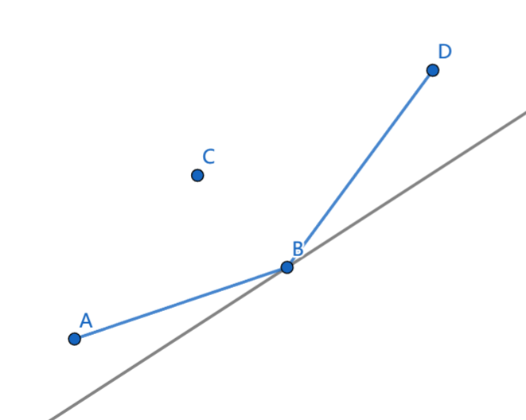
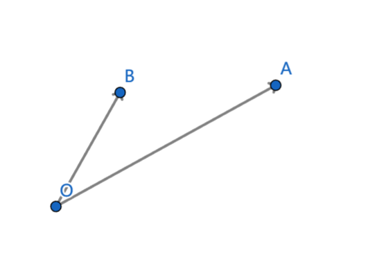
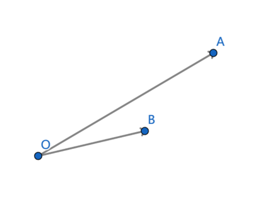
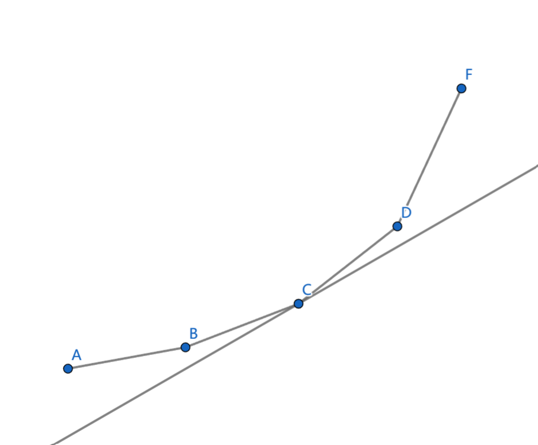

DP优化之斜率优化

# 题目描述

给定两个长度为 $n$ 的数组 $t, f$ 和一个正整数 $s$，设 $sumt[i]=\sum_{j=1}^{i}t[j]$，$sumf[i]=\sum_{j=1}^{i}f[j]$，

$dp[i][j]=\min\{dp[i - 1][p] + (sumt[j] + s \times i) \times (sumf[j] - sumf[p])\},0\le p\le j-1$。

请优化上述方程，使状态转移时间复杂度从 $O(n)$ 降低为 $O(\log n)$。

# 数据范围

$1\le n \le 5000$，$0 \le s \le 50$，$1\le t_i,f_i \le 100$。

# 推导过程

$$dp[i][j]=\min\{dp[i - 1][p] + (sumt[j] + s \times i) \times (sumf[j] - sumf[p])\},0\le p\le j-1$$

去掉 $\min$，并化简公式，

$$dp[i - 1][p] = (sumt[j] + s \times i) \times sumf[p] + dp[i][j] - (sumt[j] + s \times i) \times sumf[j]$$

设 $y(p) = dp[i-1][p]$，$k(i,j) = sumt[j] + s \times i$，$x(p) = sumf[p]$，$b(i,j) = dp[i][j] - (sumt[j] + s \times i) \times sumf[j]$，则上式可以写成，

$$y(p) = k(i,j)x(p) + b(i,j)$$

在这条式子里，$y(p)$，$k(i,j)$，$x(p)$ 都是已知的，只有 $b(i,j)$ 是未知的，因为 $b(i,j)$ 包含要求的 $dp[i][j]$。

我们的目标是使 $dp[i][j]$ 最小，也就是使截距 $b(i,j)$ 最小，如果把 $(x(p), y(p))$ 看作平面上的点，只需要用一条斜率为 $k(i,j)$ 的直线从下往上平移，那么直线第一个触碰到的点 $(x(q), y(q))$ 就是我们需要的答案，此时 $b(i,j)=y(q)-k(i,j)x(q)$，$dp[i][j]=b(i,j)+(sumt[j] + s \times i) \times sumf[j]$。



从上图可以发现，只有在下凸壳边缘的点才有可能被选中，点 $C$ 在下凸壳内不可能被选中，所以我们需要维护一个下凸壳，支持在最右边插入一个点和查询给定斜率的最小截距。

## 插入一个点

由于 $x(p)$ 是单调递增的，所以我们总是在下凸壳的最右边插入一个点。

设将要插入的点为 $A$，下凸壳最右边的点为 $B$，下凸壳次右边的点为 $O$。

如果 $OA$ 在 $OB$ 的顺时针方向或 $OA$ 与 $OB$ 重合，此时点 $B$ 在下凸壳内，需要删掉点 $B$，继续和下凸壳新的最右边两个点比较。



如果 $OA$ 在 $OB$ 的逆时针方向，那么直接把点 $A$ 插入到下凸壳末尾。



## 查询给定斜率的最小截距

下凸壳相邻点构成线段的斜率是单调递增的，我们把斜率从左往右存下来，然后使用二分查找，找到第一个比 $k(i,j)$ 大的斜率，这个斜率位置上的点就是我们要找的。



# 总结

斜率优化需要先把DP方程化简成 $y(p) = k(i,j)x(p) + b(i,j)$ 的形式，然后使用上凸壳或下凸壳维护 $(x(p),y(p))$，使得能够在 $O(\log n)$ 的时间复杂度内算出 $dp[i][j]$。

# 例题

[洛谷 P2365 任务安排](https://www.luogu.com.cn/problem/P2365)

这题卡内存，需要使用滚动数组。

# 例题代码

```cpp
#include <bits/stdc++.h>
using namespace std;
#define int long long
#define uint unsigned int
#define pii pair<int, int>
template <typename T> using vector2 = vector<vector<T>>;
template <typename T> using MaxHeap = priority_queue<T>;
template <typename T> using MinHeap = priority_queue<T, vector<T>, greater<T>>;
#define all(x) (x).begin(), (x).end()
// #define endl '\n'
// #define endl " line in : " << __LINE__ << endl

// 向量点积和叉积
struct Point { int x, y; };
#define Vector Point
Vector operator-(Point a, Point b) {
  return { a.x - b.x, a.y - b.y };
}
int cross(Vector a, Vector b) {
  return a.x * b.y - b.x * a.y;
}
// 返回值>0，ob在oa的逆时针方向
// 返回值<0，ob在oa的顺时针方向
// 返回值=0，oa与ob重合
// 逆正，顺负，重零
int vcmp(Point o, Point a, Point b) {
  return cross(a - o, b - o);
}
struct DownConvexHull {
  vector<Point> pt;
  vector<double> ks;
  void insert(Point p) {
    // p.x 应该单调递增
    if (pt.size())
      assert(p.x > pt.back().x);
    while (pt.size() >= 2) {
      int n = pt.size();
      Point p0 = pt[n - 2], p1 = pt[n - 1], p2 = p;
      if (vcmp(p0, p1, p2) <= 0)
        pt.pop_back(), ks.pop_back();
      else
        break;
    }
    if (pt.size())
      ks.push_back(1.0 * (pt.back().y - p.y) / (pt.back().x - p.x));
    pt.push_back(p);
  }
  int query(int k) {
    assert(pt.size() >= 1);
    if (pt.size() == 1) {
      // y = kx + b, b = y - kx;
      return pt[0].y - k * pt[0].x;
    }
    int i = lower_bound(all(ks), k) - ks.begin();
    return pt[i].y - k * pt[i].x;
  }
  void clear() {
    pt.clear(), ks.clear();
  }
};

const int N = 5005, INF = 1e16, P = 998244353;
int n, s, t[N], f[N], sumt[N], sumf[N], dp[2][N], *f0 = dp[0], *f1 = dp[1];
void test() {
  cin >> n >> s;
  for (int i = 1; i <= n; i++)
    cin >> t[i] >> f[i];
  for (int i = 1; i <= n; i++) {
    sumt[i] = sumt[i - 1] + t[i];
    sumf[i] = sumf[i - 1] + f[i];
  }
  int ans = INF;
  fill(f0, f0 + N, INF);
  f0[0] = 0;
  DownConvexHull dch;
  for (int i = 1; i <= n; i++) {
    fill(f1, f1 + N, INF);
    dch.clear();
    for (int j = i; j <= n; j++) {
      // y = dp[i-1][k]
      // x = sumf[k]
      if (f0[j - 1] != INF)
        dch.insert({ sumf[j - 1], f0[j - 1] });
      // b = dp[i][j] - (sumt[j] + s * i) * sumf[j]
      // dp[i][j] = (sumt[j] + s * i) * sumf[j] + b
      // k = (sumt[j] + s * i)
      f1[j] = (sumt[j] + s * i) * sumf[j] + dch.query(sumt[j] + s * i);
    }
    swap(f0, f1);
    ans = min(ans, f0[n]);
  }
  cout << ans << endl;
}
signed main() {
  ios::sync_with_stdio(0);
  cin.tie(0);
  // int T; cin >> T; while (T--)
    test();
  return 0;
}
```

最后，送给大家一只可爱的绫华。

