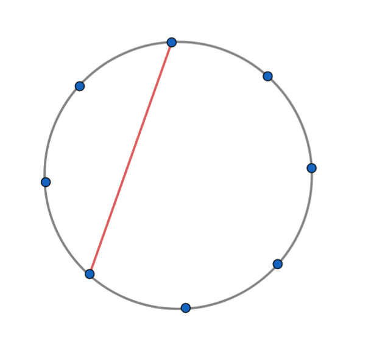
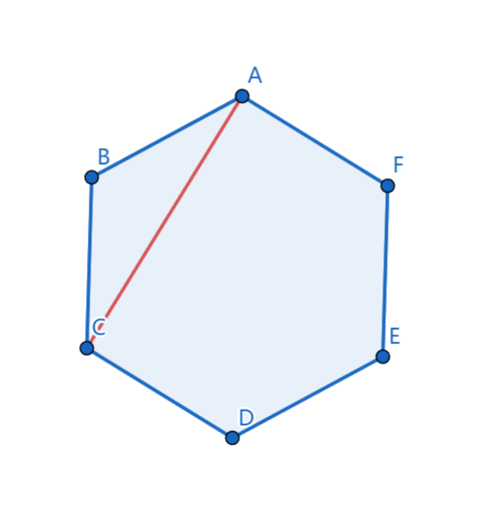
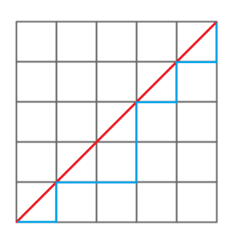
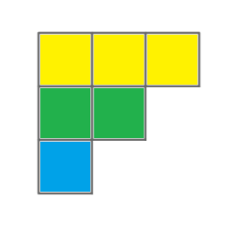
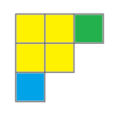
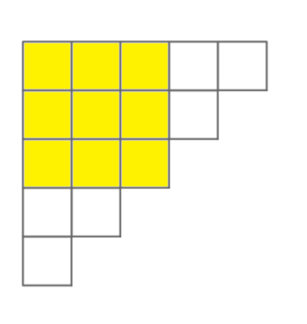

卡特兰数递推式的应用

# 前言

最近发现了一个神奇的东西，大部分跟卡特兰数相关的问题都可以化简成卡特兰数递推式的形式。

在阅读本文前，假设你已经掌握组合数，卡特兰数。

# 核心公式

$$H_n=\begin{cases}
 1 & n=0 \\
 \sum_{i=0}^{n-1}H_{i}H_{n-i-1} & n\ge 1 \\
\end{cases}$$

# 常用公式

1. $$H_n=\frac{\binom{2n}{n}}{n+1}$$

2. $$H_n=\binom{2n}{n}-\binom{2n}{n-1}$$

3. $$H_n=\frac{H_{n-1}(4n-2)}{n+1}$$

# 典型例题

## 1. 圆上线段

在圆上选 $2n$ 个点，将这些点成对连接起来，使得所得到的 $n$ 条线段不相交的方案数。

设方案数为 $dp_n$，我们连接一条线段，将所有点分成两部分，左边有 $2i$ 个点（点数必须是偶数），右边有 $2n-2i-2$ 个点，那么左边的方案数是 $dp_i$，右边的方案数是 $dp_{n-i-1}$，所以 $dp_n$ 的递推式为：

$$dp_n=\sum_{i=0}^{n-1}dp_idp_{n-i-1}$$

## 2. 括号序列

有 $n$ 对括号，求合法的括号序列数量。

设方案数为 $dp_n$，我们先写出一对括号，将所有括号分成两部分，左括号的左边有 $i$ 对括号，左括号和右括号之间有 $n-i-1$ 对括号，形式如下：

...这里有 $i$ 对括号...(...这里有 $n-i-1$ 对括号...)

那么左边的方案数是 $dp_i$，右边的方案数是 $dp_{n-i-1}$，所以 $dp_n$ 的递推式为：

$$dp_n=\sum_{i=0}^{n-1}dp_idp_{n-i-1}$$

## 3. 出栈次序

一个栈的进栈序列为 $1,2,3,\cdots,n$，有多少个不同的出栈序列？

将入栈视为左括号，出栈视为右括号，原问题变成括号序列问题。

## 4. 01序列

给出一个 $n$，要求一个长度为 $2n$ 的01序列，使得序列的任意前缀中 $1$ 的个数不少于 $0$ 的个数， 有多少个不同的01序列？

将 $1$ 视为左括号，$0$ 视为右括号，原问题变成括号序列问题。

## 5. +1,-1序列

$n$ 个 $+1$ 和 $n$ 个 $-1$ 构成的 $2n$ 项 $a_1,a_2,\cdots,a_{2n}$，前缀和满足 $a_1+a_2+\cdots+a_k\ge 0(k=1,2,3,\cdots,2n)$，有多少个满足条件的数列？

将+1视为左括号，-1视为右括号，原问题变成括号序列问题。

## 6. 找零问题

$2n$ 个人要买票价为 $5$ 元的电影票，每人只买一张，但是售票员没有钱找零。其中，$n$ 个人持有 $5$ 元，另外 $n$ 个人持有 $10$ 元，问在不发生找零困难的情况下，有多少种排队方法？

将 $10$ 元视为左括号，$5$ 元视为右括号，原问题变成括号序列问题。

## 7. 矩阵链乘

$P=a_1\times a_2\times a_3\times \cdots \times a_n$，依据乘法结合律，不改变其顺序，只用括号表示成对的乘积，试问有几种括号的方案？

注意题目中的条件：只用括号表示成对的乘积。

一个数无法成对，所以不需要括号；两个数是一对，需要一对括号；三个数可以让两个数成一对，再让剩下的一个数和上面一对组成一对，所以需要两对括号，依次类推，$n$ 个数需要 $n-1$ 对括号，原问题变成括号序列问题。

## 8. 二叉树计数

$n$ 个节点可以构造多少个不同的二叉树？

设方案数为 $dp_n$，左子树有 $i$ 个节点，右子树有 $n-i-1$ 个节点，那么左子树的方案数是 $dp_i$，左子树的方案数是 $dp_{n-i-1}$，所以 $dp_n$ 的递推式为：

$$dp_n=\sum_{i=0}^{n-1}dp_idp_{n-i-1}$$

## 9. 凸多边形划分

在一个凸 $n$ 边形中，使用 $n-3$ 条互不相交的对角线，把 $n$ 边形拆分为 $n-2$ 个三角形，问有多少种拆分方案？

设方案数为 $dp_n$，我们连接一条对角线，将 $n$ 边形分成两部分，左边是 $i$ 边形，$(i\ge 3)$，右边是 $n-i+2$ 边形。

那么左边的方案数是 $dp_i$，右边的方案数是 $dp_{n-i+2}$，所以 $dp_n$ 的递推式为：

$$dp_n=\sum_{i=3}^{n-1}dp_idp_{n-i+2}$$

设 $f_n=dp_{n+3}$，$dp_n=f_{n-3}$

$$
\begin{aligned}
 f_n &= dp_{n+3} \\
  &= \sum_{i=3}^{n+2}dp_idp_{n-i+5} \\
  &= \sum_{i=3}^{n+2}f_{i-3}f_{n-i+2} \\
  &= \sum_{i=3}^{n+2}f_{i-3}f_{n-(i-3)-1} \\
  &= \sum_{i=0}^{n-1}f_{i}f_{n-i-1} \\
\end{aligned}
$$

## 10. 单调路径
一位大城市的律师在他住所以北 $n$ 个街区和以东 $n$ 个街区处工作，每天他走 $2n$ 个街区去上班，每次只能向右走一步或向上走一步。如果他从不穿越（但可以碰到）从家到办公室的对角线，那么有多少条可能的道路？

将向右走一步视为左括号，向上走一步元视为右括号，原问题变成括号序列问题。

## 11. 填充阶梯图形

用 $n$ 个长方形填充一个高度为 $n$ 的阶梯状图形的方法个数？

设方案数为 $dp_n$，以阶梯图形的左上角为起点，任意一个拐角为终点画一个矩形，原阶梯图形被分成两个小的阶梯图形，右边的阶梯图形高度为 $i$，下边的阶梯图形高度为 $n-i-1$。

那么右边的阶梯图形的方案数是 $dp_i$，下边的阶梯图形的方案数是 $dp_{n-i-1}$，所以 $dp_n$ 的递推式为：

$$dp_n=\sum_{i=0}^{n-1}dp_idp_{n-i-1}$$

## 12. 高矮排队问题

$2n$ 个高矮不同的人，排成两排，每排必须是从矮到高排列，而且第二排比对应的第一排的人高，问排列方式有多少种？

将 $2n$ 个人按低到高排序，考虑有 $n$ 对括号的合法序列，从左往右开始，若第 $i$ 位是左括号，那么第 $i$ 个人加入第一排的末尾；若第 $i$ 位是右括号，那么第 $i$ 个人加入第二排的末尾。

举个例子：

排队前

1 2 3 4 5 6 7 8

( ( ) ) ( ) ( )

排队后

第一排 1 2 5 7

第二排 3 4 6 8

因为左括号的编号从左往右单调递增，所以第一排满足从矮到高排列。

因为右括号的编号从左往右单调递增，所以第二排满足从矮到高排列。

假设现在要放第 $i$ 个右括号，那么第 $i$ 个左括号应该先一步放好了，因为左括号的数量大于等于右括号的数量，所以第 $i$ 个右括号在第 $i$ 个左括号的后面，第二排比对应的第一排的人高，原问题变成括号序列问题。

感谢你阅读本文，请收下这只可爱的琳妮特。

