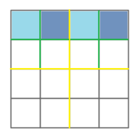
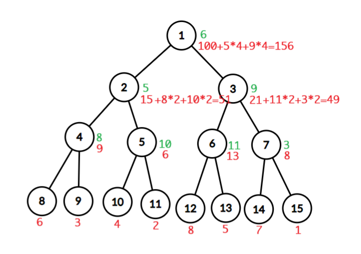
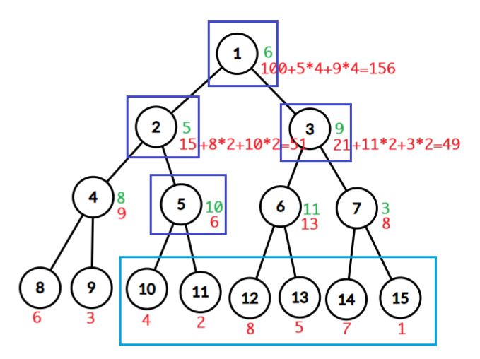
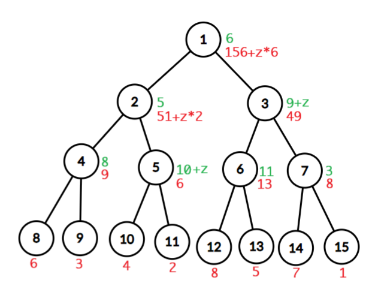
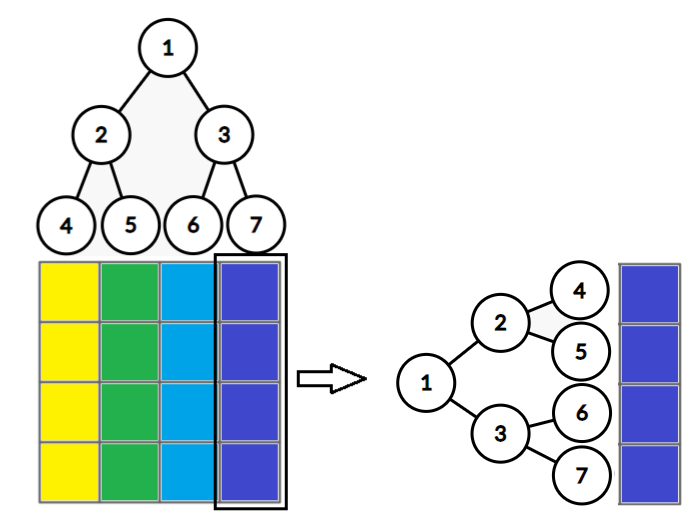
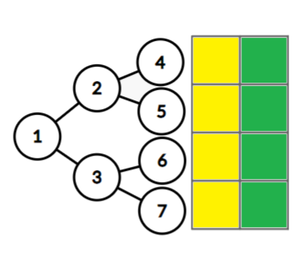
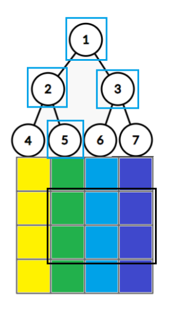

二维线段树详解

# 前言

本来想学一下二维线段树矩阵加减和矩阵求和，但网上找不到什么好的教程，只好自己写了。

在阅读本文前，假设你已经掌握一维线段树。

# 题目描述

给定一个 $n\times m$ 的全零矩阵和 $q$ 个操作，操作有两种：

- `1 x1 y1 x2 y2 z`，表示给以 $(x1, y1)$ 为左上角，$(x2, y2)$ 为右下角的矩阵中的所有数字加 $z$。

- `2 x1 y1 x2 y2`，表示求以 $(x1, y1)$ 为左上角，$(x2, y2)$ 为右下角的矩阵中的所有数字之和。

$1 \le n,m \le 2048$，$1 \le q \le 2\times 10^5$，$1 \le x1 \le x2 \le n$，$1 \le y1 \le y2 \le m$，$|z|\le 500$。

# 推导过程

二维线段树有两种写法：四叉树和树套树。

# 四叉树

顾名思义，在查询一个矩阵时，将矩阵分成左上，右上，左下和右下四个部分，然后分别递归处理，可惜单次询问的最坏时间复杂度是 $O(n)$，所以我们不使用这种写法。

例如，现在有一个 $4\times 4$ 的矩阵，我们询问第一个行的所有数字之和，但是第一行的每个数字都被遍历了一次。



在学习树套树前，我们先复习一下一维线段树的懒标记和标记永久化。

# 懒标记

一维线段树的每个节点都代表一个区间，若一个节点的懒标记为 $laz$，表示该节点区间内的所有数需要加 $laz$，但现在还没有真正加上。

# 标记永久化

在懒标记被修改后，不需要下传懒标记，取而代之的是，查询时累加路径上懒标记的贡献。

例如，现在有 $8$ 个数字构建的一维线段树，绿色数字表示节点的懒标记，红色数字表示区间内数字之和，注意，这里红色数字没有考虑当前节点的懒标记以及当前节点到根节点路径上所有节点的懒标记的贡献，相当于真实的区间和-路径上所有懒标记的贡献。



# 查询

假设我们要查询第 $3$ 个数字到最后一个数字的和，紫色方框是我们要经过的节点，考虑这些节点懒标记的贡献。



$1$. 节点区间与询问区间相交，相交数字个数与懒标记之积就是懒标记的贡献 $6 \times 6 = 36$。

$2$. 跟节点 $1$ 类似，$2 \times 5 = 10$。

$5$. 跟节点 $1$ 类似，$2 \times 10 = 20$。

$3$. 跟节点 $1$ 类似，$4 \times 9 = 36$。

最后别忘了加上节点 $5$ 和节点 $3$ 的区间和，所以第 $3$ 个数字到最后一个数字的和为 $36+10+36+20+6+49=157$。

# 修改

假设我们要使第 $3$ 个数字到最后一个数字全部加 $z$，紫色方框是我们要经过的节点，考虑修改操作对经过节点的影响。


设 $sum$ 为当前节点的区间和，$laz$ 为 当前节点的懒标记。

$1$. 节点区间与修改区间相交，对区间和的贡献为 $z$ 与相交数字个数之积，$sum += z\times 6$。

$2$. 跟节点 $1$ 类似，$sum += z\times 2$。

$5$. 节点区间被修改区间完全包含，对懒标记的贡献为 $z$，$laz += z$。

$3$. 跟节点 $5$ 类似，$laz += z$。

下面是修改完后的线段树：



# 代码实现

```cpp
#include <bits/stdc++.h>
using namespace std;
#define int long long
#define pii pair<int, int>
#define all(x) (x).begin(), (x).end()
// #define endl '\n'
// #define endl " line in : " << __LINE__ << endl
ostream& operator << (ostream &out, const pii &p) {
  return out << '{' << p.first << ',' << p.second << '}';
}
const int N = 2e5 + 5, INF = 1e17, P = 998244353;
#define lc (x << 1)
#define rc (x << 1 | 1)
struct SegmentTree {
  int n;
  vector<int> sum, laz;
  void init(int n) {
    assert(n >= 1);
    this->n = n;
    sum.assign(n * 4 + 5, 0);
    laz.assign(n * 4 + 5, 0);
  }
  void modify(int x, int l, int r, int L, int R, int V) {
    if (L <= l && r <= R) {
      laz[x] = laz[x] + V;
      return;
    }
    int mid = (l + r) >> 1;
    if (L <= mid) modify(lc, l, mid, L, R, V);
    if (R > mid) modify(rc, mid + 1, r, L, R, V);
    sum[x] += V * (min(r, R) - max(l, L) + 1);
  }
  void modify(int L, int R, int V) {
    assert(1 <= L && L <= R && R <= n);
    modify(1, 1, n, L, R, V);
  }
  int query(int x, int l, int r, int L, int R) {
    int res = laz[x] * (min(r, R) - max(l, L) + 1);
    if (L <= l && r <= R)
      return res + sum[x];
    int mid = (l + r) >> 1;
    if (L <= mid) res = res + query(lc, l, mid, L, R);
    if (R > mid) res = res + query(rc, mid + 1, r, L, R);
    return res;
  }
  int query(int L, int R) {
    assert(1 <= L && L <= R && R <= n);
    return query(1, 1, n, L, R);
  }
};
#undef lc
#undef rc
SegmentTree tree;
int a[15] = { INF, 6, 3, 4, 2, 8, 5, 7, 1 };
void test() {
  tree.init(8);
  for (int i = 1; i <= 8; i++)
    tree.modify(i, i, a[i]);
  tree.modify(1, 8, 6);
  tree.modify(1, 4, 5);
  tree.modify(5, 8, 9);
  tree.modify(1, 2, 8);
  tree.modify(3, 4, 10);
  tree.modify(5, 6, 11);
  tree.modify(7, 8, 3);
  cout << tree.query(3, 8) << endl;
}
signed main() {
  ios::sync_with_stdio(0);
  cin.tie(0);
  // int T; cin >> T; while (T--)
  test();
  return 0;
}
```

# 树套树

顾名思义，线段树套线段树，假设有一个 $n\times m$ 的矩阵，我们先将每一列视为一个元素，那么现在有 $m$ 个元素，对这 $m$ 个元素建一颗线段树，每个元素表示一个列的区间，由于每个元素有 $n$ 行，所以我们需要给每个元素再建一颗线段树。

例如，有一个 $4\times 4$ 的矩阵，线段树的结构如下：



接下来的修改和查询操作比较抽象，请跟紧我的思路。

# 约定

列线段树维护列区间，行线段树维护行区间，列线段树的每个节点由行线段树组成，行线段树就是上面的一维线段树。

列线段树的每个节点代表一个列区间，这个列区间用行线段树维护。

一个列节点需要两颗行线段树，一颗是 $sum$ 维护列区间的区间和，一颗是 $laz$ 维护列区间的懒标记。

例如，我们取出上面节点 $2$ 的 $sum$ 和 $laz$。



$sum$ 的每一个节点表示一个行区间的区间和，例如节点 $3$ 表示第 $3$ 行和第 $4$ 行所有数字之和。

$laz$ 的每一个节点表示一个行区间所有行需要加的数之和，例如节点 $5$ 表示第 $2$ 行的所有数需要加的数，节点 $3$ 表示第 $3$ 行需要加的数与第 $4$ 行需要加的数之和。

# 查询

假设我们要查询第 $2$ 列到第 $4$ 列，第 $2$ 行到第 $3$ 行的区间和。

蓝色方框内是我们要经过的节点，考虑每个节点 $sum$ 和 $laz$ 对答案的贡献。



$1.$ 节点列区间与询问列区间相交，对答案的贡献为相交列的数量与懒标记之积，$3 \times laz[1].\text{query}(2, 3)$。

$2.$ 跟节点 $1$ 类似，$1\times laz[2].\text{query}(2, 3)$。

$5.$ 节点列区间被询问列区间完全包含，先累加懒标记对答案的贡献，再累加区间和对答案的贡献，$1\times laz[5].\text{query}(2, 3)+sum[5].\text{query}(2, 3)$。

$3.$ 跟节点 $5$ 类似，$2\times laz[3].\text{query}(2, 3)+sum[3].\text{query}(2, 3)$。

# 修改

假设我们要使第 $2$ 列到第 $4$ 列，第 $2$ 行到第 $3$ 行的所有数字加 $z$。

蓝色方框内是我们要经过的节点，考虑修改操作对每个节点的影响。


$1$. 节点区间与询问区间相交，对区间和的贡献为相交列的数量与 $z$ 之积，$sum[1].\text{modify}(2, 3, z \times 3)$。

$2$. 跟节点 $1$ 类似，$sum[2].\text{modify}(2, 3, z \times 1)$。

$5$. 节点区间被修改区间完全包含，对懒标记的贡献为 $z$，$laz[5].\text{modify}(2, 3, z)$。

$3$. 跟节点 $5$ 类似，$laz[3].\text{modify}(2, 3, z)$。

# 代码实现

只需要在一维线段树的基础上改动少量代码。

```cpp
#include <bits/stdc++.h>
using namespace std;
#define int long long
#define pii pair<int, int>
#define all(x) (x).begin(), (x).end()
// #define endl '\n'
// #define endl " line in : " << __LINE__ << endl
ostream& operator << (ostream &out, const pii &p) {
  return out << '{' << p.first << ',' << p.second << '}';
}
const int N = 2e5 + 5, INF = 1e17, P = 998244353;
#define lc (x << 1)
#define rc (x << 1 | 1)
struct SegmentTree {
  int n;
  vector<int> sum, laz;
  void init(int n) {
    assert(n >= 1);
    this->n = n;
    sum.assign(n * 4 + 5, 0);
    laz.assign(n * 4 + 5, 0);
  }
  void modify(int x, int l, int r, int L, int R, int V) {
    if (L <= l && r <= R) {
      laz[x] = laz[x] + V;
      return;
    }
    int mid = (l + r) >> 1;
    if (L <= mid) modify(lc, l, mid, L, R, V);
    if (R > mid) modify(rc, mid + 1, r, L, R, V);
    sum[x] += V * (min(r, R) - max(l, L) + 1);
  }
  void modify(int L, int R, int V) {
    assert(1 <= L && L <= R && R <= n);
    modify(1, 1, n, L, R, V);
  }
  int query(int x, int l, int r, int L, int R) {
    int res = laz[x] * (min(r, R) - max(l, L) + 1);
    if (L <= l && r <= R)
      return res + sum[x];
    int mid = (l + r) >> 1;
    if (L <= mid) res = res + query(lc, l, mid, L, R);
    if (R > mid) res = res + query(rc, mid + 1, r, L, R);
    return res;
  }
  int query(int L, int R) {
    assert(1 <= L && L <= R && R <= n);
    return query(1, 1, n, L, R);
  }
};
struct SegmentTree2 {
  int n, m;
  // vector<int> sum, laz;
  vector<SegmentTree> sum, laz;
  void init(int n, int m) {
    this->n = n, this->m = m;
    sum.assign(n * 4 + 5, {});
    laz.assign(n * 4 + 5, {});
    for (int i = 0; i < n * 4 + 5; i++)
      sum[i].init(m), laz[i].init(m);
  }
  void modify(int x, int l, int r, int L, int R, int U, int D, int V) {
    if (L <= l && r <= R) {
      // laz[x] = laz[x] + V;
      laz[x].modify(U, D, V);
      return;
    }
    int mid = (l + r) >> 1;
    if (L <= mid) modify(lc, l, mid, L, R, U, D, V);
    if (R > mid) modify(rc, mid + 1, r, L, R, U, D, V);
    // sum[x] += V * (min(r, R) - max(l, L) + 1);
    sum[x].modify(U, D, V * (min(r, R) - max(l, L) + 1));
  }
  void modify(int L, int R, int U, int D, int V) {
    assert(1 <= L && L <= R && R <= n && 1 <= U && U <= D && D <= m);
    modify(1, 1, n, L, R, U, D, V);
  }
  int query(int x, int l, int r, int L, int R, int U, int D) {
    // int res = laz[x] * (min(r, R) - max(l, L) + 1);
    int res = laz[x].query(U, D) * (min(r, R) - max(l, L) + 1);
    if (L <= l && r <= R)
      return res + sum[x].query(U, D);
    int mid = (l + r) >> 1;
    if (L <= mid) res = res + query(lc, l, mid, L, R, U, D);
    if (R > mid) res = res + query(rc, mid + 1, r, L, R, U, D);
    return res;
  }
  int query(int L, int R, int U, int D) {
    assert(1 <= L && L <= R && R <= n && 1 <= U && U <= D && D <= m);
    return query(1, 1, n, L, R, U, D);
  }
};
#undef lc
#undef rc
int n, m, q;
SegmentTree2 tree;
void test() {
  cin >> n >> m;
  tree.init(n, m);
  // for (int i = 1; i <= n; i++)
  //   for (int j = 1; j <= n; j++) {
  //     int t; cin >> t;
  //     tree.modify(i, i, j, j, t);
  //   }
  int op, x1, y1, x2, y2, z;
  // cin >> q;
  while (cin >> op) {
    if (op == 1) {
      cin >> x1 >> y1 >> x2 >> y2 >> z;
      tree.modify(x1, x2, y1, y2, z);
    }
    else {
      cin >> x1 >> y1 >> x2 >> y2;
      cout << tree.query(x1, x2, y1, y2) << endl;
    }
  }
}
signed main() {
  ios::sync_with_stdio(0);
  cin.tie(0);
  // int T; cin >> T; while (T--)
  test();
  return 0;
}
```

# 例题

[LOJ #135. 二维树状数组 3：区间修改，区间查询](https://loj.ac/p/135)

这题是二维树状数组的模板题 ~~（我们二维线段树也想要有属于自己的模板题，呜呜呜）~~ ，可以偷来当作二维线段树的模板题使用，但由于二维线段树的空间常数和时间常数较大，会在最后四个测试点 [MLE](https://loj.ac/s/2000677)，把测试数据下载到本地，在本地跑一遍，结果如下：

```
1: 18ms
2: 2090ms
3: 1992ms
4: 1977ms
5: 1985ms
6: 1967ms
7: 7159ms
8: 7234ms
9: 7329ms
10: 6795ms
```

所以，单次询问 $O((log_2n)^2)$ 的时间复杂度是对的，就是常数大了一点。

# 题外话

二维线段树能把区间求和改为区间最值或者区间 $\gcd$ 等别的运算符吗？

很可惜，不能，感兴趣的读者可以思考一下原因。

提示：请仔细思考在修改操作中，维护 $sum$ 的过程。

感谢你阅读本文，请收下这只可爱的心海。


