C++编译运行环境配置

# 安装 MinGW

打开 `https://github.com/niXman/mingw-builds-binaries/releases`

下载 `x86_64-13.2.0-release-win32-seh-msvcrt-rt_v11-rev0.7z
`

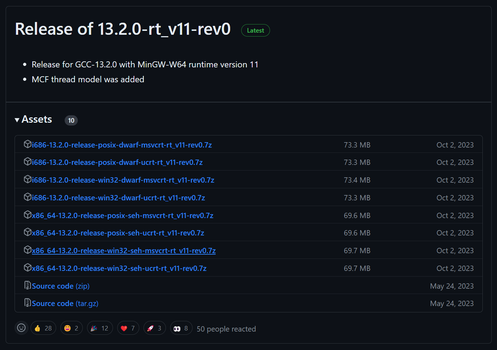

把压缩包解压到C盘根目录（可以根据需要修改）。

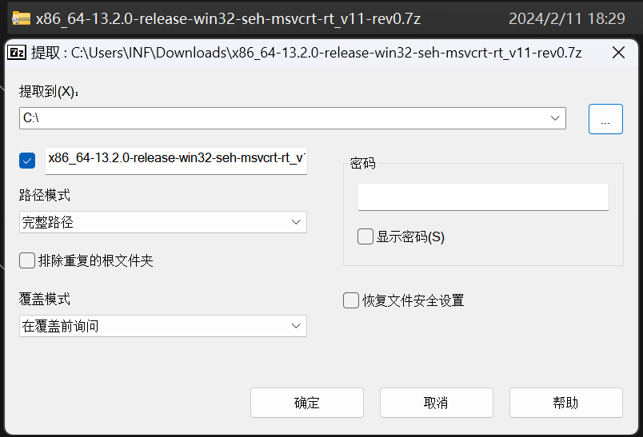

# 配置环境变量

打开系统，依次点击高级系统设置，环境变量，

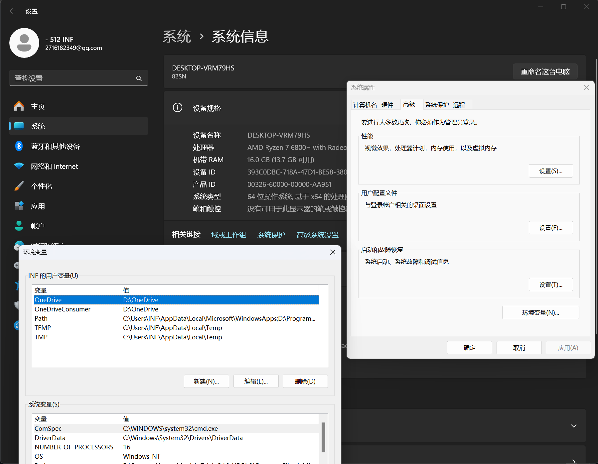

双击 Path，然后点击新建，在输入框中填入 `C:\x86_64-13.2.0-release-win32-seh-msvcrt-rt_v11-rev0\mingw64\bin`，然后点击确定，重复三次。

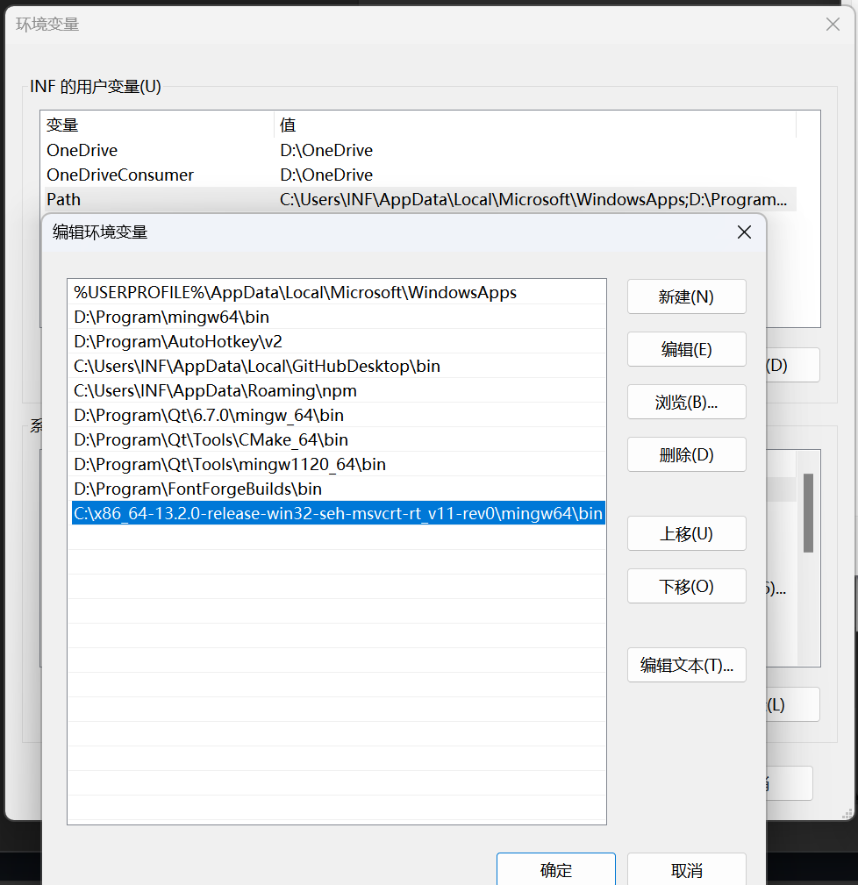

按下 Win+R，输入 cmd 回车，然后在 cmd 中输入 `gcc -v`，出现和下图一样的画面表示配置成功。

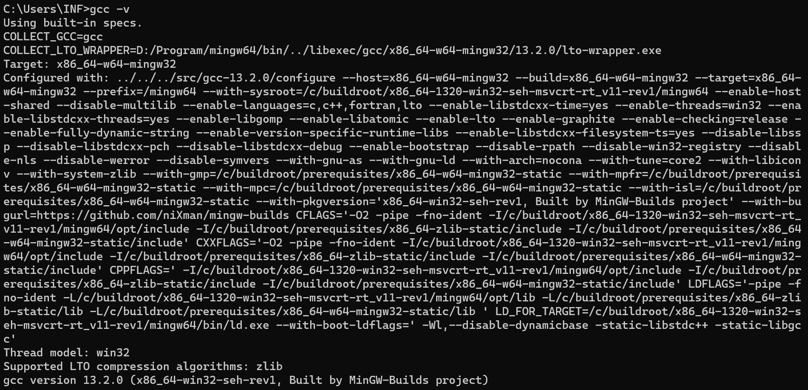

# 安装 Sublime Text

打开 `https://www.sublimetext.com/`

点击蓝色的 `DOWNLOAD FOR WINDOWS` 按钮，下载 `sublime_text_build_4169_x64_setup.exe`。

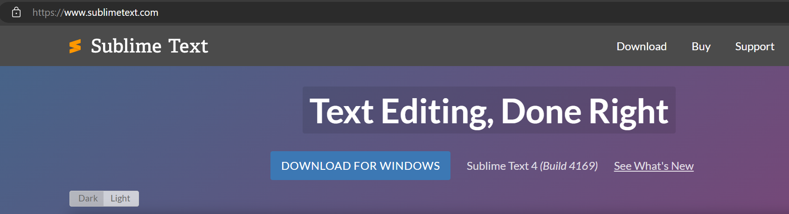

运行 `sublime_text_build_4169_x64_setup.exe`，然后依次点击 `Next` 和 `Install`，等待安装完成。

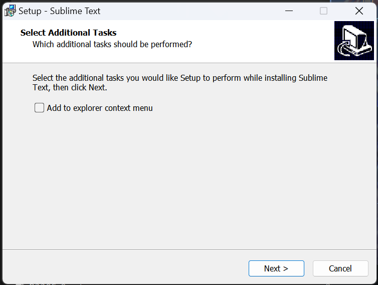

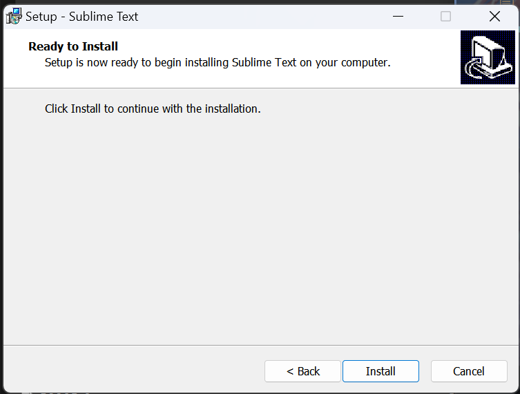

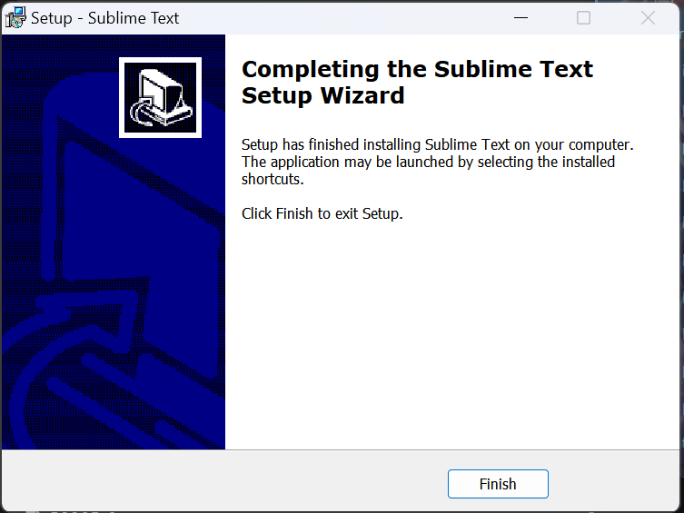

安装完后，打开 Sublime Text。

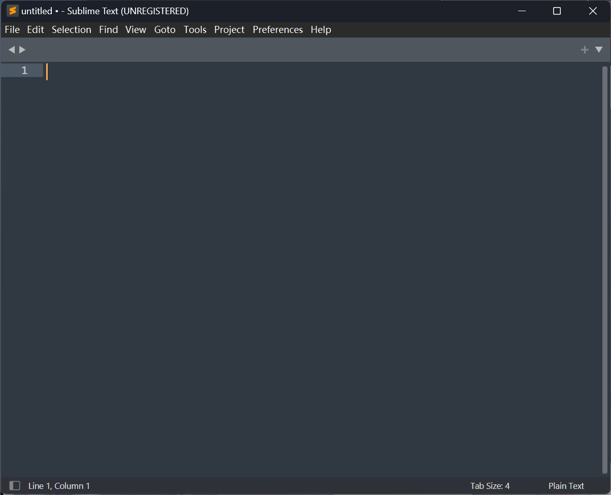

# 安装 Package Control

按下 Ctrl+Shift+P，输入 `install`，选中 `Install Package Control` 回车。

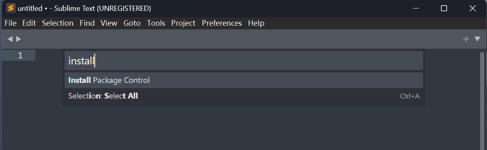

等待安装完成。

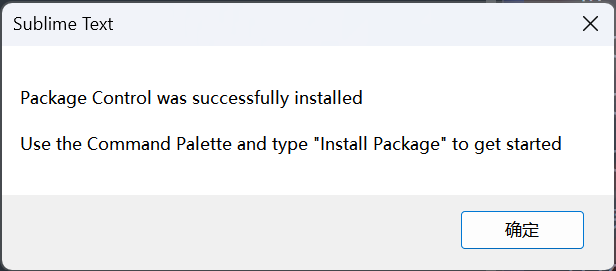

# 安装 PackageResourceViewer

按下 Ctrl+Shift+P，输入 `install`，选中 `Install Package` 回车。

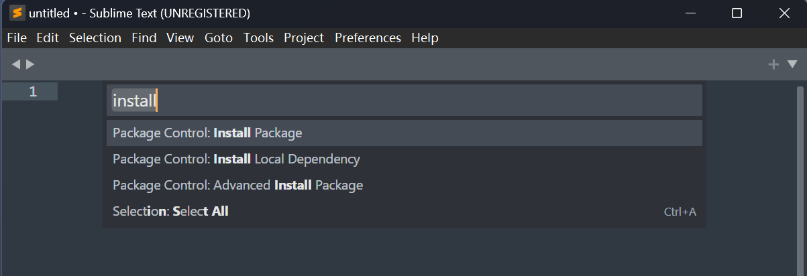

输入 `prv`，选中 `PackageResourceViewer` 回车。

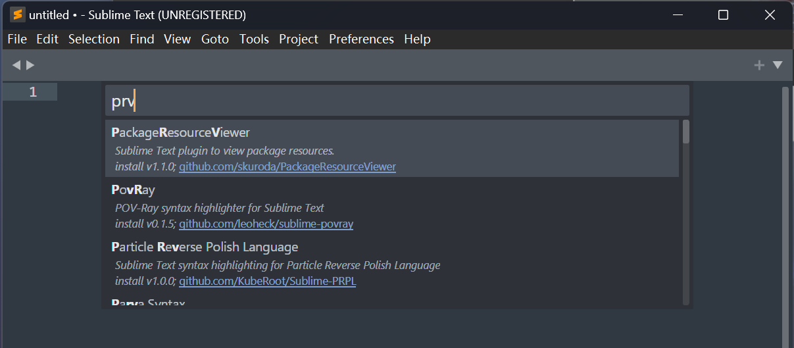

# 配置C++编译运行命令

按下 Ctrl+Shift+P，输入 `prvor`，选中 `Open Resource` 回车。

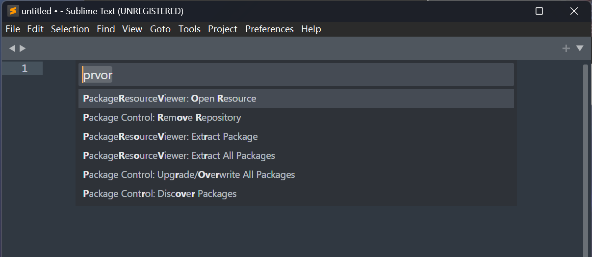

输入 `C++` 回车，然后输入 `C++sf` 回车。

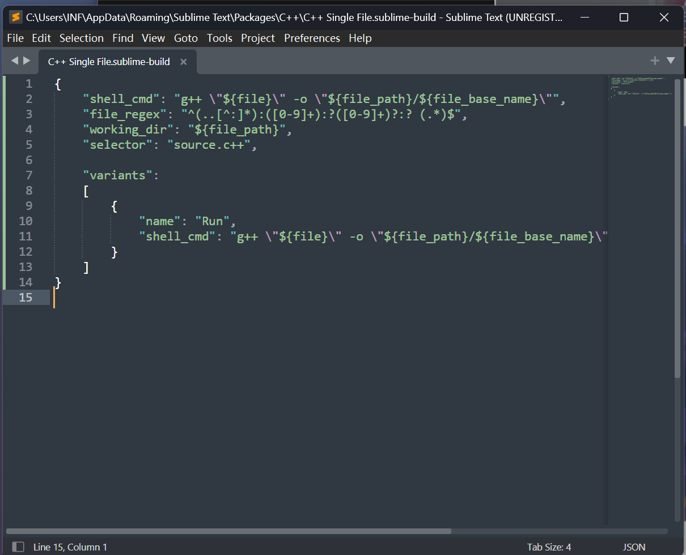

将第11行替换为 `"shell_cmd": "g++ \"${file}\" -o \"${file_path}/${file_base_name}\" && start cmd /c \"\"${file_path}/${file_base_name}\" & pause\""`，然后保存关闭。

# 编译运行

按下 Ctrl+N 和 Ctrl+S，将文件命名为 `test.cpp` 保存到桌面。

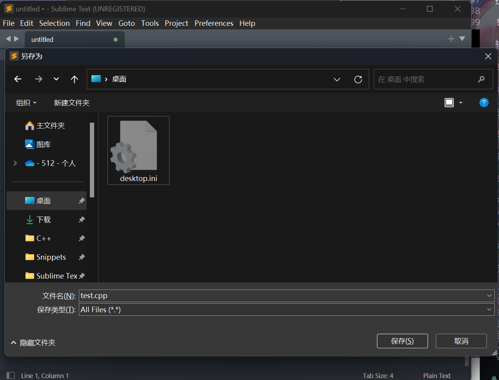

在 `test.cpp` 中填入下面的代码：

```cpp
#include <iostream>
using namespace std;
int main() {
  cout << "Hello World" << endl;
  return 0;
}
```

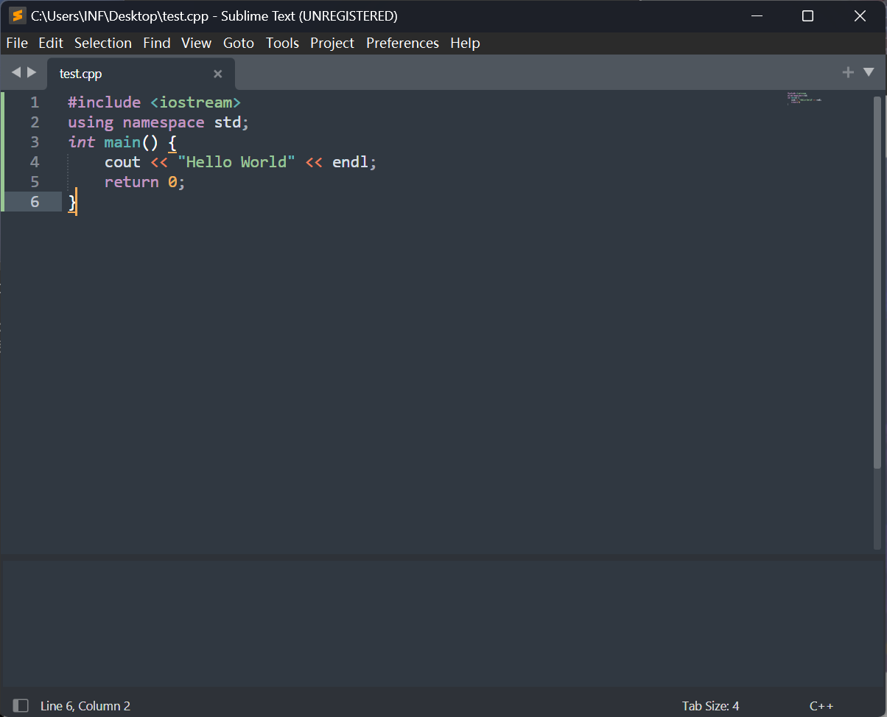

按下 Ctrl+Shift+B，选中 `C++ Single File - Run` 回车。

而 Ctrl+B 会直接执行上次在 Ctrl+Shift+B 中选中的命令。

出现下面的画面表示配置成功。

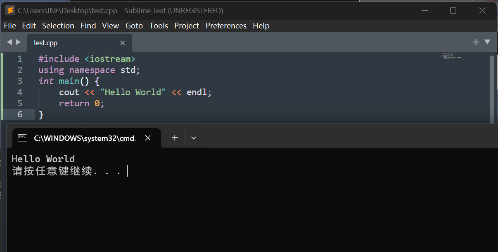

想要更加炫酷~~麻烦~~的界面可以看[这篇文章](https://inf-512.github.io/other/sublime_text_setting/)。
