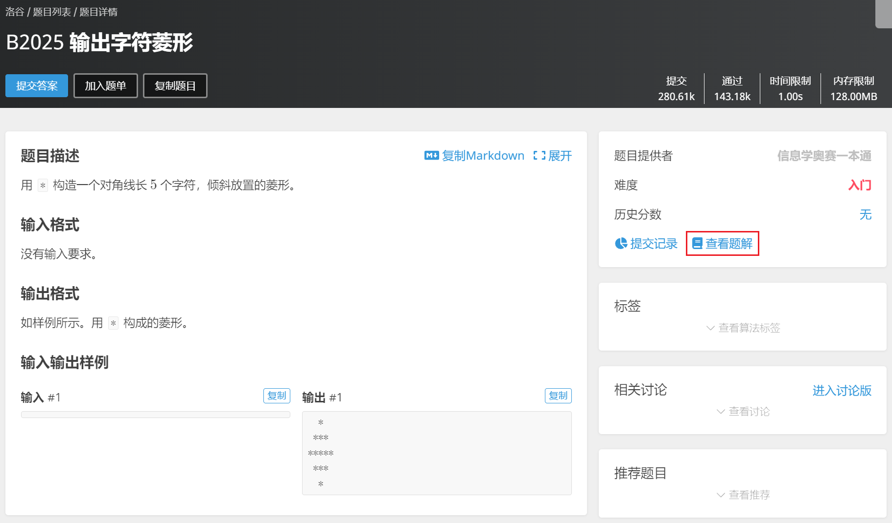

没有资源怎么自学信竟

任何一个伟大的思想，都有一个微不足道的开始。

# 前言

首先，我不得不承认一个事实，有资源（有一个什么都懂的教练或大佬指导）比没资源（自己查资料）要舒服得多，但没资源不是说不能自学信竟，而是这条路真的很难走，我就是自学信竟过来的，其中经历的困难只有自己知道。例如，不知道要学什么，不知道要怎么学，不知道去哪个网站刷题最好，不知道要刷哪些题，不知道哪些题不用刷，不知道怎么提升自己的水平等等等等，我就不一一列举了，只有亲身经历过大概才能理解吧。

所以我想要给初次接触信竟的小白们指一条没那么曲折的路，但能不能有所作为，还是得靠自己。

# 第一阶段：掌握C++语法

OI Wiki：https://oi-wiki.org/lang/

菜鸟教程：https://www.runoob.com/cplusplus/cpp-tutorial.html

C++参考手册：https://zh.cppreference.com/w/cpp

C++参考手册（chm离线版）：https://github.com/myfreeer/cppreference2mshelp/releases

这里给了四个网站，语法主要在 OI Wiki 和菜鸟教程上学习，查函数可以直接百度或者查C++参考手册，但最好还是查手册，手册官网的搜索功能用不了，可以下载chm离线版，里面可以用索引键入关键字进行查找。

# 第二阶段：算法训练

洛谷官方题单：https://www.luogu.com.cn/training/list

洛谷精选题单：https://www.luogu.com.cn/training/9391

这个阶段我只推荐在洛谷刷题，因为如果遇到不会的题，可以直接查看很多题解，一篇题解没看懂就换另一篇，还是看不懂就百度，不怕看不懂，不怕学不会。

# 第三阶段：思维训练

Codeforces：https://codeforces.com/

AtCoder：https://atcoder.jp/

这个阶段和第二阶段没有先后顺序，可以交替进行。在这个阶段，你需要到 Codeforces 上刷题和打比赛，在这之前最好先准备一个[有道词典](https://fanyi.youdao.com/download-Windows)。

这里我只推荐刷 Codeforces 的构造题（constructive algorithms），难度设置为 1600 分以下，这个难度可以根据需要调整。

如果不会写可以百度或者点击右下角的 Tutorial(en) 看题解。

Codeforces 会定期举办比赛，时间通常是当天的晚上 10:35，比赛持续 2 小时。

AtCoder 的比赛和 Codeforces 类似，这里不再过多介绍。

当你能稳定做出 Codeforces Div.2 的 ABC 三题时，就可以进入阶段四了。

# 第四阶段：查漏补缺

NOI 大纲（2023年修订版）：https://www.noi.cn/upload/resources/file/2023/03/15/1fa58eac9c412e01ce3c89c761058a43.pdf

OI Wiki：https://oi-wiki.org/

这是我现在所处的阶段。NOI 大纲包含所有需要用到的算法，如果对其中某个算法不熟悉，可以去 OI Wiki 重新学习一下，OI Wiki 的文章质量比较高，但有些冷门知识点写得不是很好，需要自行查百度。

# 第五阶段：挑战难题

如果你已经学完 NOI 大纲的所有知识点，那么就去洛谷挑战紫题和黑题吧，有很多意想不到的惊喜在那里等着你。

# 学习资源

OI Wiki：https://oi-wiki.org/

最全的 OI 知识点整合网站。

洛谷：https://www.luogu.com.cn/

有合理的难度划分和超多题解。

Codeforces：https://codeforces.com/

国外最大的编程竞赛平台，每周都会举行高质量的比赛。

Codeforces 从 1000 分到 2400+ 分的方法：https://github.com/E869120/Competitive-Programming/blob/master/%5BTutorial%5D%20A%20Way%20to%20Practice%20Competitive%20Programming.pdf

NOI 大纲（2023年修订版）：https://www.noi.cn/upload/resources/file/2023/03/15/1fa58eac9c412e01ce3c89c761058a43.pdf

C++参考手册：https://zh.cppreference.com/w/cpp

AtCoder：https://atcoder.jp/

跟 Codeforces 类似。

https://kenkoooo.com/atcoder#/table//

AtCoder 的辅助网站，能查自己的做题记录。

https://csacademy.com/app/graph_editor/

能将树和图可视化。

https://www.latexlive.com/

写数学公式必备。

牛客竞赛：https://ac.nowcoder.com/acm/contest/vip-index

LOJ：https://loj.ac/

UOJ：https://uoj.ac/contests

https://inf-512.github.io/

~~趁机推广一波自己的博客~~

# 一些建议

1. 写过的算法模板和数据结构模板一定要存起来。

如果你有其他问题或者是更好的建议，可以在评论区留言。
