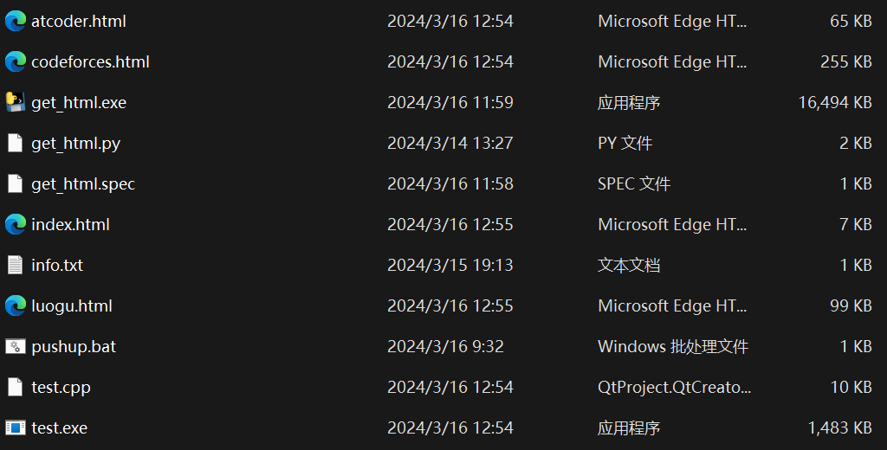
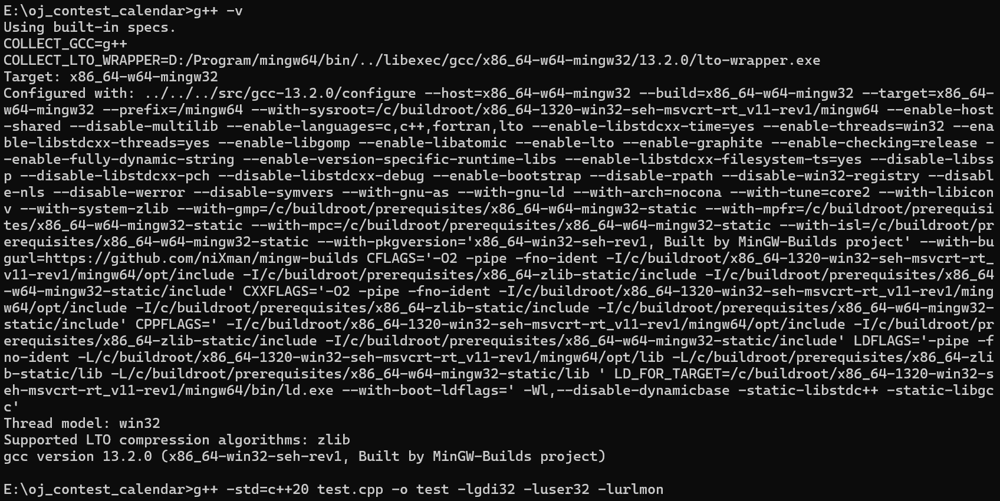
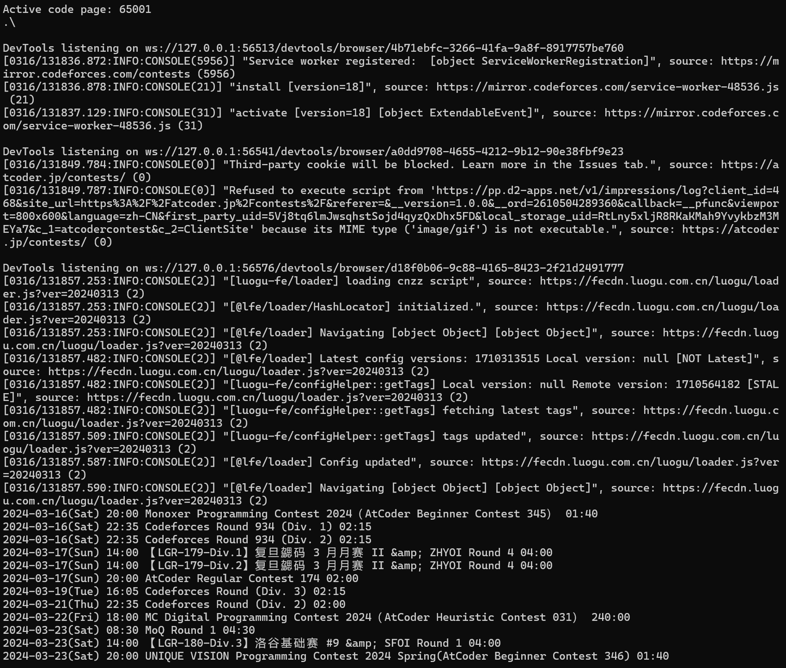
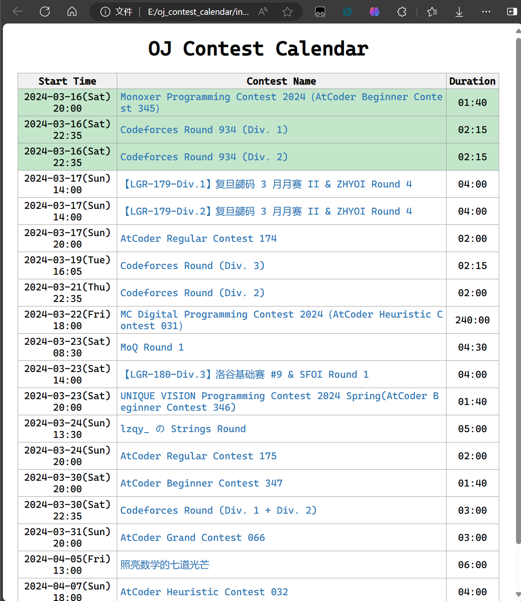

# OJ比赛日历离线版

## 前言

如果这个日历不再更新了，可以按照下面的方式查看。

## 正文

1. 下载 oj_contest_calendar.7z 并解压到当前文件夹。

https://github.com/INF-512/INF-512.github.io/tree/main/other/oj_contest_calendar_offline/oj_contest_calendar.7z



2. 编译 test.cpp，g++ 版本最好在 13.0.0 以上。

```g++ -std=c++20 test.cpp -o test -lgdi32 -luser32 -lurlmon```



3. 运行 test.exe。



4. 打开 index.html。


